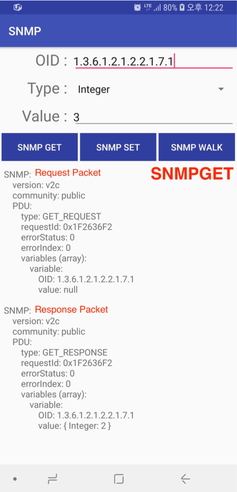
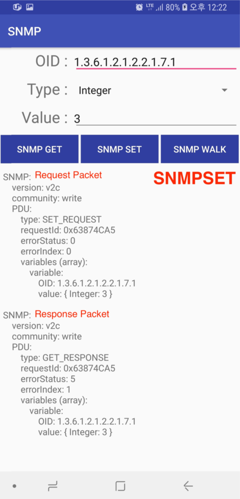
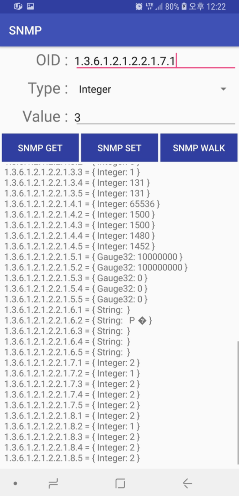

# SNMP Android Client

### This is an assignment of Internet Protocols (COSE441) of Korea University in 2018 spring semester

Assignment description document is DOCUMENT.pdf    
My submitted report is REPORT.pdf

## What this do

 - Encode and decode SNMP packets to byte array.    
 - Send and receive SNMP packets to SNMP server which is provided by professor
 - Create SNMP Packets of SNMPGET, SNMPSET, SNMPWALK functions    

## Screenshots

The last image is snmp-walk
